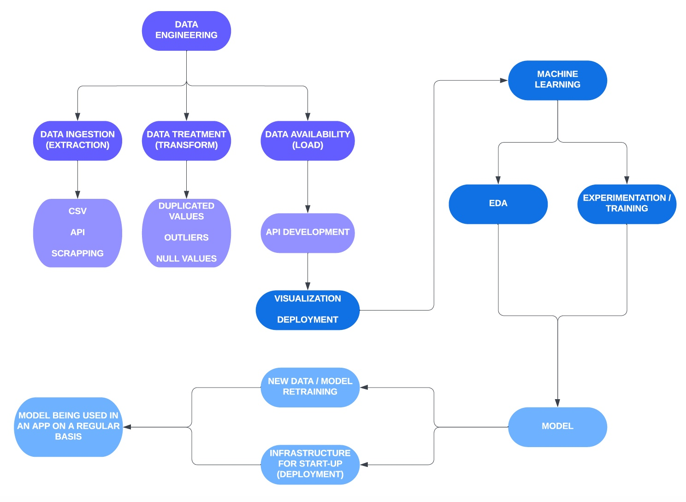
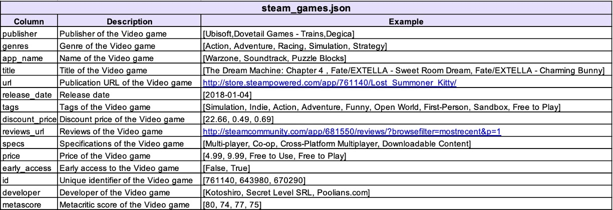
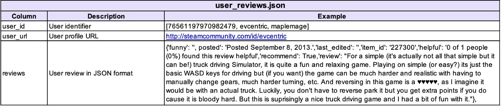
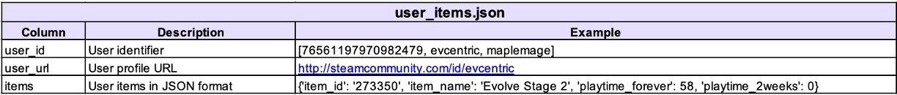
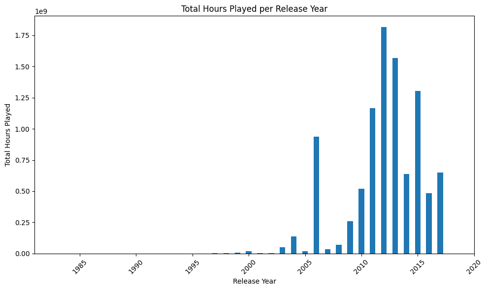
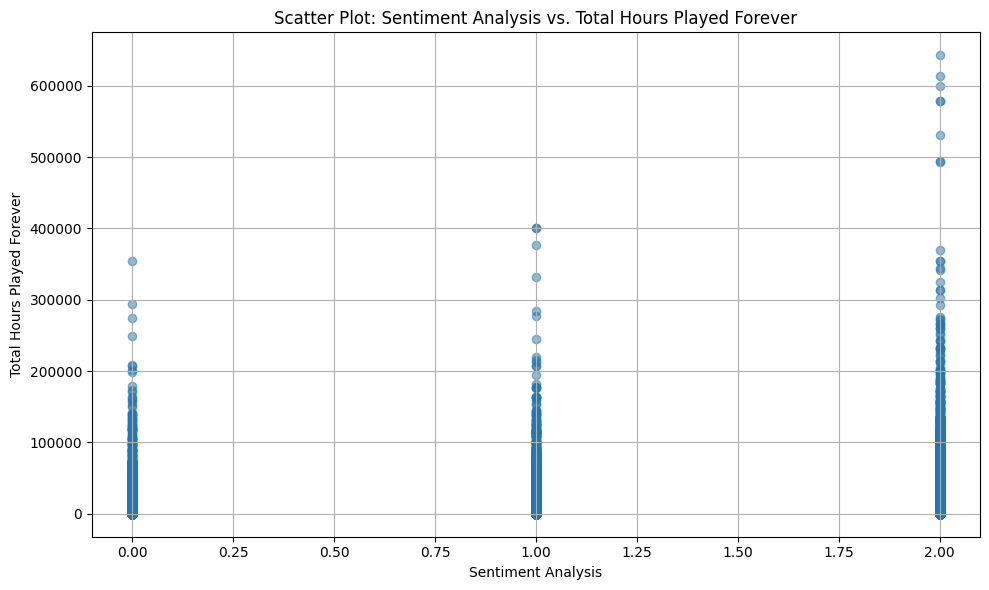
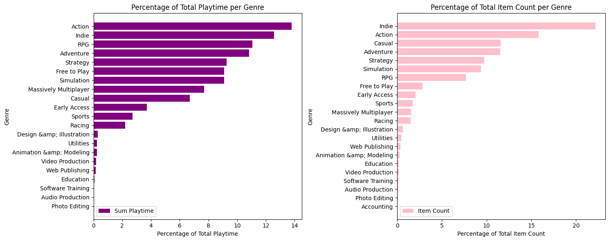
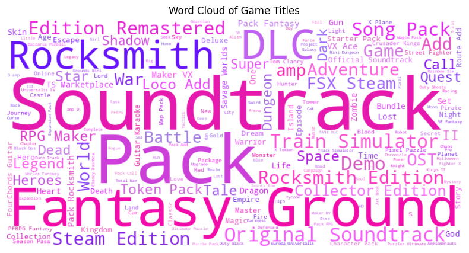
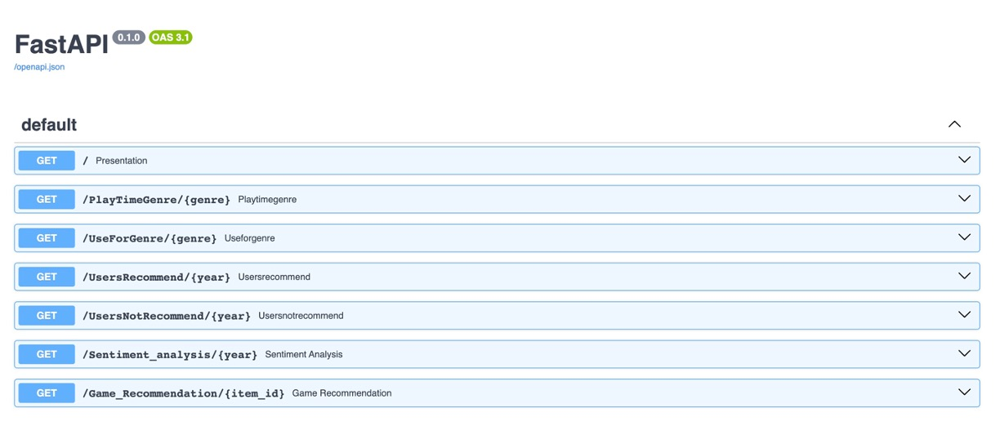

#  **
Video Games - Machine Learning & Operations Model
** 

# 
Enhancing Gaming Experiences with a Recommendation System

## *1. Introduction & Context*

We've recently joined Steam, a global gaming platform, as a Data Scientist. Our exciting mission is to create our very first machine learning model to address a critical business problem: Steam urgently needs a user-centric video game recommendation system. However, as we dive into the data, we discover its lack of maturity, with raw, nested data and no automated processes for updating new products, among other challenges, making our job seem daunting.

To tackle this, we're starting from scratch, taking on the role of a Data Engineer to swiftly build a Minimum Viable Product (MVP) that will meet the project's completion deadline. It's a demanding task that might feel overwhelming at times, but we're determined to follow the conceptual path and overcome any obstacles along the way. Our journey begins with courage and determination. 💪🎮

 
 

  

To accomplish our mission, we will follow these steps according to our MLOps Role:

  

## *2. Dataset Description & Dictionary*

To comply with the project objectives, the company gave us three different datasets:

### *2.1. Dataset 1: steam_games.json:*

This is the dictionary of the data in order to understand what is this dataset about:

  

We can see that there is information regarding every video game that can give us an idea its general description. also, we can check that the columns 'genres', 'tags' and 'specs' have lists with the features that apply for each videogame. In other words, one videogame can have a diversity of genres, tags and specs, and the company organizes that information into lists. 

### *2.2. Dataset 2: user_review.json:*

This is the dictionary of the data in order to understand what is this dataset about:

  

We can see that there is information regarding every user review. However, in the column "reviews" we can see that there are nested data that need special attention. Here, we can find information about the following:

  - funny: If other user found the review 'funny'.
  - posted: Date when the review was posted.
  - last-edited: Date when the user made the last edition of his/her review.
  - helpful: If other user found the review 'helpful'.
  - recommend: If the user recommend the video game.
  - 'review': A text written by the user making a review of the video game.

### *2.3. Dataset 3: users_items.json:*

This is the dictionary of the data in order to understand what is this dataset about:

  

We can see that there is information regarding the video games (items) that every user has played. However, in the column "items" we can see that there are nested data that need special attention. Here, we can find information about the following:

 - item_id: Unique identifier of te video game.
 - item_name: Title of the video game.
 - playtime_forever: Total hours played by the user forever.
 - playtime_2weeks: Total hours played by the user in the last 2 weeks.

We can see that we have a lot of information regarding the video games that users interact with. 

To download the original datasets, due to their weight, they can be found at the following link: [Original Datasets](https://drive.google.com/drive/folders/1HqBG2-sUkz_R3h1dZU5F2uAzpRn7BSpj).

## *3. Extraction, Transformation, and Loading (ETL)*

As mentioned earlier, we have nested data that requires preprocessing for manipulation. Additionally, there is redundant or unnecessary information that needs to be removed from the analysis. On the other hand, we need to group certain information and merge datasets to ensure that all the data is in the required format for the subsequent steps. You can find more details in the following links:

1. [1_ETL_DS13.ipynb](https://github.com/Grisales1803/IProject1_VideogamesMLOps/blob/main/Notebooks/1_ETL_DS13.ipynb): This notebook contains all the initial transformations for datasets 1 and 3.
2. [2_ETL_DS2_NLP.ipynb](https://github.com/Grisales1803/IProject1_VideogamesMLOps/blob/main/Notebooks/2_ETL_DS2_NLP.ipynb): This notebook contains all the initial transformations for dataset 2 and the Natural Language Processing (NLP) transformation that we will analyze later.
3. [3_ETL_F12.ipynb](https://github.com/Grisales1803/IProject1_VideogamesMLOps/blob/main/Notebooks/3_ETL_F12.ipynb): This notebook contains all the transformations needed to include only the data required for functions 1 and 2, which we will discuss later.
4. [4_ETL_F345.ipynb](https://github.com/Grisales1803/IProject1_VideogamesMLOps/blob/main/Notebooks/4_ETL_F345.ipynb): This notebook contains all the transformations needed to include only the data required for functions 3, 4, and 5, which we will discuss later.
5. [5_ETL_ML1.ipynb](https://github.com/Grisales1803/IProject1_VideogamesMLOps/blob/main/Notebooks/5_ETL_ML1.ipynb): This notebook contains all the transformations needed to include only the data required for the recommendation system, which we will discuss later.

## *4. Natural Language Processing (NLP)*

Natural Language Processing (NLP) is a field of artificial intelligence (AI) that focuses on the interaction between computers and human language. It involves the development of algorithms and models to enable computers to understand, interpret, and generate human language.

Our objective is to convert the reviews of each user into a dicrete column called "sentiment_analysis". The idea is to assign the value of '0' if the review is bad, '1' if it is neutral and '2' if it is positive. If there is not a review, by default we are going to assing '1'.

To do a sentiment analysis of a text we can use the library [vaderSentiment](https://github.com/cjhutto/vaderSentiment). 

The VADER (Valence Aware Dictionary and sEntiment Reasoner) library is a tool for analyzing and quantifying the sentiment or emotional tone of text data. It is specifically designed to work with text data that is often found in social media, online reviews, and informal communication, where traditional sentiment analysis methods may struggle due to the use of slang, abbreviations, emojis, and other language nuances.

You can check all this transformations and assumptions in the notebook [2_ETL_DS2_NLP.ipynb](https://github.com/Grisales1803/IProject1_VideogamesMLOps/blob/main/Notebooks/2_ETL_DS2_NLP.ipynb)

## *5. Functions*

As we said before, the company needs to do some queries in order to take sme important decision, in the notebook [7_FunctionsML.ipynb](https://github.com/Grisales1803/IProject1_VideogamesMLOps/blob/main/Notebooks/7_FunctionsML.ipynb) it is possible to check the development of the following functions:

  **1. PlayTimeGenre**(`genre`: str):

  It should return the release year with the most played hours for the given `genre`.

  Example of return: {"Release year with the most played hours for Genre X" : 2013}

  **2. UserForGenre**(`genre`: str):

  It should return the user who has accumulated the most played hours for the given `genre` and a list of the accumulated playtime by release year.

  Example of return: {"User with the most played hours for Genre X" : us213ndjss09sdf, "Playtime":[{Year: 2013, Hours: 203}, {Year: 2012, Hours: 100}, {Year: 2011, Hours: 23}]}

  **3. UsersRecommend**(`year`: int):

  It returns the top 3 games MOST recommended by users for the given `year` (reviews.recommend = True and positive/neutral comments).

  Example of return: [{"Rank 1" : X}, {"Rank 2" : Y},{"Rank 3" : Z}]

  **4. UsersNotRecommend**(`year`: int):

  It returns the top 3 games LEAST recommended by users for the given `year` (reviews.recommend = False and negative comments).

  Example of return: [{"Rank 1" : X}, {"Rank 2" : Y},{"Rank 3" : Z}]

  **5. Sentiment_analysis**(`year`: int):

  Based on the release `year`, it returns a list with the count of user review records categorized with sentiment analysis.

  Example of return: {"Negative": 182, "Neutral": 120, "Positive": 278}

## *6. Exploratory Data Analysis (EDA)*

EDA serves as the foundation for any data analysis or modeling task. It helps us uncover insights, assess data quality, and make informed decisions about how to proceed with our analysis, leading to more accurate and reliable results. You can find more details in the notebook called [6_EDA.ipynb](https://github.com/Grisales1803/IProject1_VideogamesMLOps/blob/main/Notebooks/6_EDA.ipynb).

### *6.1. Playtime per release year:*

  

In the histogram, it is evident that games released in 2012 have accumulated the highest number of playtime hours among users. Subsequently, games launched in later years have not achieved a similar level of popularity. This phenomenon is quite normal, as video games typically require time to establish themselves among users.

### *6.2. Sentiment Analysis and Play Time:*

  

Effectively we can see that the higher the sentiment analysis, more users with the highest hours played. So this is a good inicator that our NPL model was correctly made. 

### *6.3. Most popular genres:*

  

When comparing both histograms, we notice that the 'Action' genre exhibits high playtime, which can be attributed to its presence in nearly 17% of the items. Conversely, 'Multiplayer' games constitute only 2% of the items but account for almost 8% of the total user playtime. This observation suggests that launching more multiplayer video games could be a strategic decision.

While the dataset primarily consists of categorical variables, limiting the scope for quantitative exploratory analysis, the exploratory data analysis (EDA) has yielded valuable insights for the business. The forthcoming API aims to assist the analytics team by providing answers to critical queries that inform decision-making.

### *6.4. Titles Word Cloud:*

The word cloud serves as a valuable tool for summarizing and visually representing textual data, allowing for quick insights and a better understanding of the underlying themes and content within a dataset, in this case, of video game titles. 

  

We can see that the words that are more repetitive in the videogames titles are:

- **Soundtrack:** Suggests that many of the games may offer a soundtrack or music-related content.
- **Pack:** Implies that there might be downloadable content (DLC) packs associated with these games.
- **Fantasy:** Could indicate that a significant number of titles are within the fantasy genre.
- **Ground:** Might suggest a common setting or theme related to the ground or terrain.
- **Rocksmith:** Could refer to a specific game title or franchise.
- **DLC:** Signifies that downloadable content is a common feature among these games.

This excercise helped us to understand the patterns and recurring elements within video game titles and help us to do a first categorization of waht type of genres are most popular. As we could see before, we have a lot of words that implies that the game are related with action or adventure.

## *7. Recommendation System - Machine Learning Model*

We are going to build a recommendation system based in content. This is a type of recommendation system that suggests items to users based on the characteristics and properties of those items. In a content-based recommendation system, each item (e.g., a product, a movie, a song) is represented by a set of descriptive features or attributes. These features could include keywords, genres, actors, directors, user reviews, product descriptions, and more. The goal is to create a profile for each item that captures its unique characteristics. Considering those profiles, we can find similiarities between different items. More detailed information can be found in the notebook [5_ETL_ML1.ipynb](https://github.com/Grisales1803/IProject1_VideogamesMLOps/blob/main/Notebooks/5_ETL_ML1.ipynb)

So, here we are going to have the following function # 6:

 **6. Game_Recommendation**(`item_id`: int):

 By entering the `item_id`, we should receive a list with 5 recommended games similar to the one entered.

  Example of return: [{"Rec 1": "PAYDAY™ The Heist"}, {"Rec 2": "The Kings' Crusade"}, {"Rec 3": "Red Faction®: Armageddon™"}, {"Rec 4": "No Man's Sky"}, {"Rec 5": "Robocraft"} ]

The features that we are going to use are the column 'tags', because it the feature that has less null values and most of the time considers data that is in the 'genres' and 'specs' columns.

At the beginning we tried to use the cosine-similarity method, which represents the item and its features (tags) as vectors. However, for the calculation it took more than 30 seconds, which represents a high consumption of resources. That's why we tried with an approximation, which is the **LSH (Locality-Sensitive Hashing)** method. 

### *7.1. Locality-Sensitive Hashing (LSH) Method:*

**Locality-Sensitive Hashing (LSH)** is a technique used in data mining and information retrieval to approximate similarity between data points in a high-dimensional space. It's often used as an alternative to traditional similarity measures like cosine similarity when dealing with large datasets where exact similarity computation becomes computationally expensive.

For this method we use something called **Random Binary Projections**.

**Random Binary Projections** are a specific type of hash function used in LSH. These hash functions work by randomly generating a set of binary values (0s and 1s) and using them to project the data points onto a lower-dimensional space. The randomness of these projections is a key factor in LSH because it introduces a controlled level of randomness that helps group similar data points together with a higher probability.

### *7.2. Recommendation Example:*

**For example:** Running the function for the item_id 10.0 (Counter-Strike) the model made the following recommendations:

[{'Rec 1': 'Insurgency'},  
 {'Rec 2': 'Eradicator'},  
 {'Rec 3': 'Battlefield: Bad Company™ 2'},  
 {'Rec 4': 'Counter-Strike: Source'},  
 {'Rec 5': 'Counter-Strike: Condition Zero'}]

Since 'Counter-Strike' is an 'Action' game, we can see that the recommendations have titles that let us now that they are 'Action' video games too. However, since the results seem very good, we may need some metrics to evaluate the performance of the model.

### *7.3. Evaluation Metrics:*

in this case we don't have the real recommendation made by a real person, in order to make a comparison between the model and the reality. But, we can consider some other metrics that evaluates the smilarities between the item_id entered by the user an the items recommended by the model. These metrics can be the following:

1. **Recall of Common Features:**

Recall measures the proportion of common features between the recommended items compared to all possible common features. We can calculate it as follows:

$$ \text{Recall} = \frac{\text{Number of Common Features Identified}}{\text{Total Number of Common Features in Recommendations}} $$

This will give us an idea of how many of the common features among recommended items the model was able to identify.

2. **Precision of Common Features:**

Precision measures the proportion of correctly identified common features among the recommended items compared to all identified features. We can calculate it as follows:

$$ \text{Precision} = \frac{\text{Number of Correctly Identified Common Features}}{\text{Total Number of Identified Features}} $$

This will give us an idea of how accurately the model identifies common features among the recommended items.

3. **F1-Score of Common Features:**

The F1-Score combines recall and precision into a single metric and can be useful if we want to strike a balance between both metrics. we can calculate it as follows:

$$ \text{F1-Score} = 2\cdot \frac{\text{Precision} \cdot \text{Recall}}{\text{Precision}+\text{Recall}} $$

This will provide us with a metric that considers both precision and recall.

4. **Jaccard Similarity of Common Features:**

Jaccard Similarity is used to measure the similarity between sets and can be useful for evaluating the similarity between common features identified by the model and the actual common features. We can calculate it as follows:

$$ \text{Jaccard Similarity} = \frac{\text{Size of Intersection}}{\text{Size of Union}} $$

This will give us a measure of the similarity between the identified common features and the actual common features.

Considering a random sample of 50 recommendations, we obtained the following results:

| Metric                | Result      | Comments                                     |
|--------------------------------|------------------------------------------------|---------------------------------------------------|
| Recall    |    0.5982+/-0.2933   | Recall measures the ability of our recommendation system to find all the relevant video games for a user based on their input. This tells us how good our video game recommendation system is at finding all the video games the user really like when he/she asks for them. An average recall of 0.5982 means that, on average, our system manages to find about 59.82% of the video games the user loves. The +/- 0.2933 part shows that sometimes it might find a bit more or less, like when you find some extra cool video games in your collection on some days but not on others.                   |
| Precision   |  0.6197+/-0.2735   | Precision measures the accuracy of our recommendation system by assessing the ratio of relevant video games among the recommended ones. This is like making sure that when our video game recommendation system says, "Here are some great games!" it's really good at picking games that the user loves. An average precision of 0.6197 means that, on average, about 61.97% of the games it suggests are the ones the user really, really likes. The standard deviation (+/- 0.2735) tells us that sometimes it's a little better at this, and sometimes it's a bit less accurate, kind of like how some days it's better at finding your most video game and other days it's not as spot on.                    |
| F1-Score   |  0.6025+/-0.2862  | The F1-Score is the harmonic mean of precision and recall and is a balance between the two. An average F1-Score of 0.6025 suggests a reasonable balance between precision and recall in our recommendations. The standard deviation (+/- 0.2862) indicates variability across different random selections.                    |
| Jaccard Similarity   |  0.5423+/-0.3309   | Jaccard Similarity measures the similarity between the set of recommended items and the set of relevant items. An average Jaccard Similarity of 0.5423 suggests that, on average, there is a 54.23% similarity between the recommended items and the relevant items. The standard deviation (+/- 0.3309) indicates the variability in similarity across different random selections.                   |

In summary, our content-based recommendation system seems to have a reasonable level of performance, with a decent balance between precision and recall. However, there is some variability in these metrics across different random selections, which may indicate that the system's performance could be further optimized. These metrics provide insights into how well our system is capturing relevant items and how precise its recommendations are. By the other hand, as we exposed before, there must be a good balance between similarities and differences to avoid showing exactly the same content, but keeping some differences that can cause a pleasant surprise in the user. The metrics above show that balance and that is exactly what we want. Also, it is good to notice that we did not use the cosine-similarity method due to it consumes high quantity of resources, so we decided to use an approximation called LSH (Locality-Sensitive Hashing), that converts our information using hash functions in order to consume less resources but keeping the differences and similarities. For sure there is always room for improvement, but this basic model was optimized to consume the less resources with the most of performance. Finally, the tags showed that they are a good way to describe an item and look for similarities in the recommendation system. 

## *8. API Deployment*

An API, or Application Programming Interface, serves as a framework of rules and protocols that enable diverse software applications to seamlessly communicate with each other. It defines the methods and data formats that applications can employ to request and exchange information or carry out specific actions. APIs are instrumental in facilitating the integration of disparate software systems, allowing them to collaborate and share data and functionality.

In this project, we have developed an API using **FastAPI** ([refer to the documentation](https://fastapi.tiangolo.com/es/)) to enable the entire company to interact with the dataset through functions that represent their specific queries.

For the deployment of this API, we have harnessed the capabilities of Render **Render** ([consult documentation here](https://render.com/)), a versatile platform designed to host a wide array of applications, including web applications, APIs, and backend services. Notably, Render seamlessly integrates with GitHub, simplifying the deployment process further.

To explore the deployed API for this project, please visit the following page: [API Deployment: https://projecti1-henryjcg.onrender.com/docs#/ ](https://projecti1-henryjcg.onrender.com/docs#/). The explanations within each function will guide you on inputting the relevant data.

  

Also, here's the repository we used for the API deployment: [API Repository](https://github.com/Grisales1803/PI1_API_Deploy)

## *9. Conclusions*

In this project of Video Games Recommendation System we found out the following:

- **Data Handling:** The project involved comprehensive data handling, including preprocessing, cleaning, and merging in groups of three distinct datasets. The complexity of the data required careful attention to detail and domain-specific knowledge.

- **Natural Language Processing (NLP):** The integration of NLP for sentiment analysis of user reviews added a valuable layer of data understanding. This allowed for more user-centric recommendations based on user sentiments.

- **Exploratory Data Analysis (EDA):** EDA provided essential insights into playtime, sentiment analysis, and popular genres. These insights were crucial in shaping the recommendation system and providing a better understanding of user preferences.

- **Recommendation System:** The content-based recommendation system, built using Locality-Sensitive Hashing (LSH) for efficient similarity calculations, performed reasonably well. The balance between precision and recall indicated that the system successfully identified relevant games while maintaining a good level of accuracy.

- **API Deployment:** The deployment of the API using FastAPI on the Render platform ensures accessibility and ease of use for the entire company. The integration of functions to interact with the dataset empowers teams to make data-driven decisions.

## *10. Recommendations*

- **Data Quality Improvement:** Consider investing in data quality improvement measures, including data enrichment and automated processes for updating new products. High-quality data is fundamental to the success of machine learning models.

- **Continuous Model Evaluation:** While the content-based recommendation system shows promise, continuous model evaluation and improvement are necessary. We use an approximation of the cosine-similarity method sacrificing accuracy for less resoruces consumption. But with a better infrastructure and more resources, the modeling would be more accurate.

- **User-Centric Enhancements:** Focus on making the recommendation system more user-centric. Incorporate user behavior, preferences, and feedback to provide personalized recommendations. In this case, we used only the tags to look for similarities. Although the model showed a good performance, with more resources we can considerate some other metrics. 

- **Integration with Steam:** Explore possibilities for collaboration with Steam to access real-time data and enhance the recommendation system's accuracy. This could include direct access to user reviews, playtime data, and more.

- **Scalability:** As the user base grows, we need to ensure that the system is scalable to handle increased data volume and user interactions. Consider cloud-based solutions for scalability.

- **Feedback Mechanism:** Implement a feedback mechanism within the recommendation system to allow users to rate and provide feedback on recommended games. This data can be used for model refinement. Rating can be a good variable to consider in the recommendation system.

- **Monitoring and Maintenance:** Establish a monitoring and maintenance plan for the deployed API to ensure it continues to perform optimally. Regularly update the API to accommodate changes in the dataset and user preferences.

- **Documentation and Training:** Provide comprehensive documentation and training for teams within the company to effectively utilize the API. This includes clear guidelines on how to interact with the functions and interpret results.

- **Security:** Implement robust security measures to protect user data and ensure the API's security. This is especially important when dealing with user reviews and preferences.

- **User Education:** Educate users on how to make the best use of the recommendation system. Offer guidance on refining recommendations and understanding the system's capabilities and limitations.

Finally, while the project has achieved its minimum viable product (MVP) and delivered a functional recommendation system, there is room for further improvement and expansion. User-centric enhancements, data quality improvements, and continuous evaluation will be critical in ensuring the recommendation system's long-term success in enhancing gaming experiences on the Steam platform.

## *11. Requirements*

- Python.
- FastAPI.
- Uvicorn.
- Pandas.
- Numpy.
- Scikit-Learn.
- Nearpy.
- Pyarrow.
- Matplotlib.
- Render.

## *12. Author*

- **Juan Camilo Grisales López**
- Mail: grisales1803@gmail.com
- Linkedin: [https://www.linkedin.com/in/grisales1803/](https://www.linkedin.com/in/grisales1803/)
